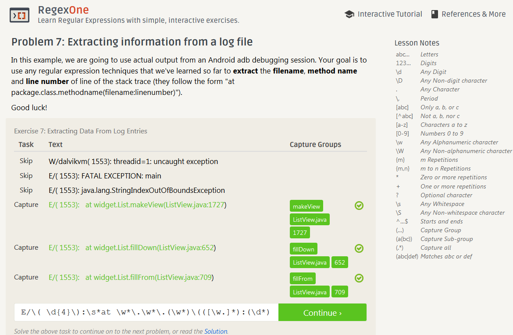
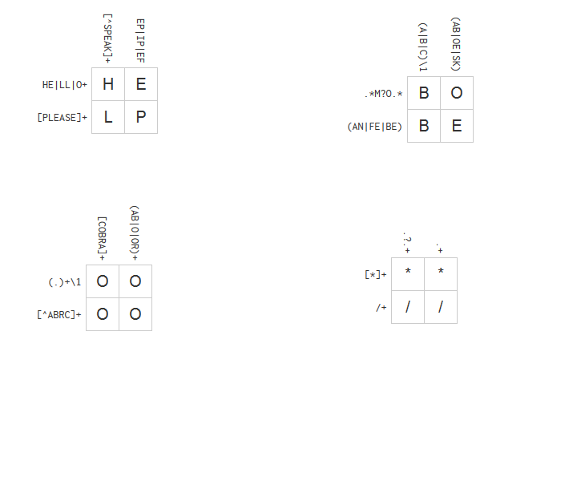
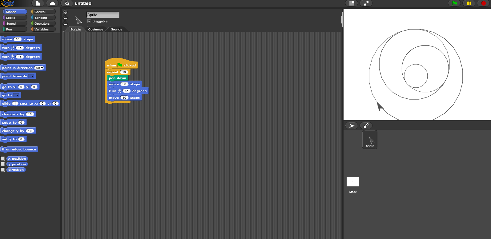

LAB 1
=====

## The open source definition opensource.org/osd :
1. Free redistribution - no royalties
2. Source code - must contain source code that can be distributed
3. Derived works - must allow for modifications
4. Integrity of the author's source code - may only restrict modified distribution if the license allows patches
5. No discrimination against persons or groups
6. No discrimination against fields of endeavor
7. Distribution of license - license applies to those who it is redistributed to
8. License must not be specific to a product
9. License must not restrict other software
10. License must be technology-neutral

##Suggestions for how to ask questions in a helpful way:
1. Don't cram multiple non related questions into one thread.
2. If you get multiple solutions, thank both answerers and choose the most appropriate for your project.

##Screenshot of tree:

##RegexOne:
####Answers:
1. ^[\d-.,e]*$
2. (\d{3})
3. ([\w.]*)[+@]
4. <(\w*)
5. (\w*)\.(jpg|gif|png)$
6. ^\s*(.*)$
7. E/\( \d{4}\):\s*at \w*\.\w*\.(\w*)\(([\w.]*):(\d*)

####Screenshot:

##RegexCrossword
####Screenshot

##Snap!

##Problem/Project Idea
     I am thinking of a website where people can freely contribute to similar
to Wikipedia, except the website will be used to view and search through the
structure of an organization or object.  For example, the website would have a
search for companies, then you could find departments within the company, and
famous people within those departments.  By selecting something on the website
you are given a quick fact sheet about that object instead of a full Wikipedia
page.  The idea is to have a visual search that is somewhere between Wikipedia
and a quick Google search.  In order to go about this, I would start a Project
on Github with the proper licensing, and then try to get a team of developers
together in order to begin structuring the website.  Database manipulation will
be a huge task as well as coming up with an intuitive and visual user interface.
