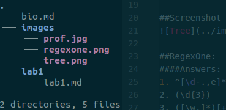

LAB 1
=====

## The open source definition opensource.org/osd :
1. Free redistribution - no royalties
2. Source code - must contain source code that can be distributed
3. Derived works - must allow for modifications
4. Integrity of the author's source code - may only restrict modified distribution if the license allows patches
5. No discrimination against persons or groups
6. No discrimination against fields of endeavor
7. Distribution of license - license applies to those who it is redistributed to
8. License must not be specific to a product
9. License must not restrict other software
10. License must be technology-neutral

##Suggestions for how to ask questions in a helpful way:
1. Don't cram multiple non related questions into one thread.
2. If you get multiple solutions, thank both answerers and choose the most appropriate for your project.

##Screenshot of tree:

##RegexOne:
####Answers:
1.
  a. abc
  b. 123
2. ...\.
3. [cmf]an
4. [^b]og
5.
