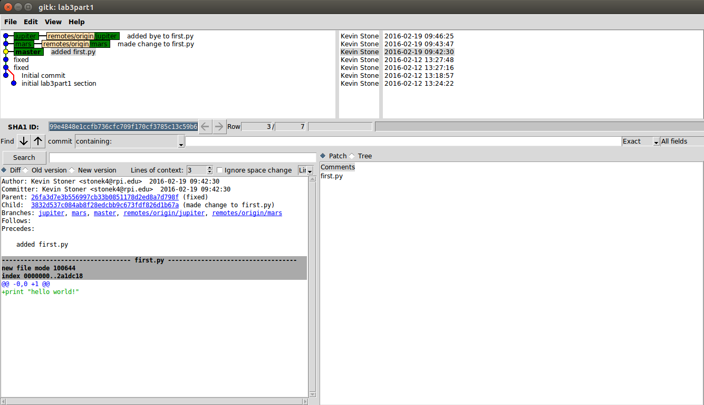

LAB 3
=====
## Link to [part 1](https://github.com/stonek4/lab3part1)

## Screenshot of gitk 

## Screenshot of branching tutorial 

## Link to [part 3](https://github.com/stonek4/courseproject)

## Link to [part 5](https://github.com/paulSambolin/Story)

## Link to [part 6](https://github.com/dangothemango/NewStory/tree/Table5)
