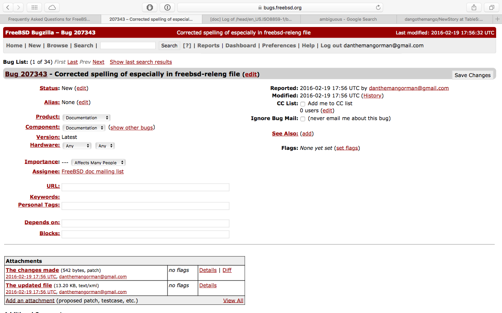

LAB 4
=====

##Summary
In this lab we found bugs in FreeBSD.  We found two bugs, one of which was
correcting a spelling mistake, and another was adding parenthesis to add
improve clarity.  Despite the seemingly small size of these changes, fixing
errors in documentation can have a monumental effect on the understanding
for future generations to come.  Keeping clean documentation for any project
is important because it encourages people to contribute and use the project.
Documentation with too many errors may cause people to give up, or move
to a different program instead.  I learned that it is easy to make a
contribution that will help many people.

## Screenshot of email 
