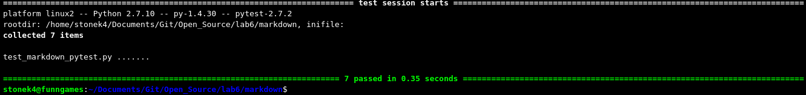

LAB 6
=====

##Trellis
- Number of Contributers - 1
- Number of Lines of Code - 3595
- Number of Commits - 8
- Latest Commit - Added reset method (Dec. 10, 2015)
- Current branches - 1 (master)

##Screenshot of running pytest:

##Markdown links:
[markdown.py](markdown/markdown.py)
[test_markdown_pytest.py](markdown/test_markdown_pytest.py)
